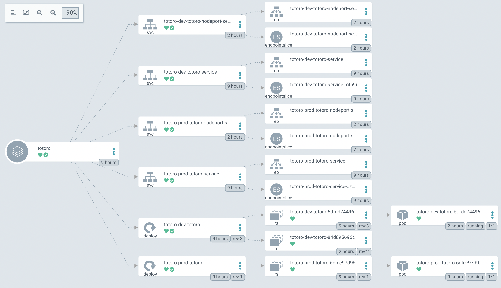

# Hello TOTORO

## 简介

GitOps 是通过 git 用来管理声明式的部署文件的技术规范，使用不同的工具（Flux2 ArgoCD 等）来实现 GitOps。

GitOps 最佳实践之一就是将业务仓库和部署配置文件独立分开。

两个仓库:

1. [业务仓库 totoro](https://github.com/hardy4yooz/totoro.git)
2. [部署配置仓库 totoro-gitops](https://github.com/hardy4yooz/totoro-gitops.git)

## 流程

### CI 部分

    1. git push 业务 代码
    2. github action 触发构建，推送 `image` 到 `DockerHub`
    3. 修改 `totoro-gitops` 配置，可以在action 的 step 里修改，也可以手动修改；

### CD 部分（ArgoCD)

    1. 手动sync 
    2  自动同步 or webhook 
    3. ArgoCD 检查 current state <-> desired state
    4. 执行 manifest、kustomize、helm 等

### CMD

    ``` Shell
    argocd login  <ARGOCD_SERVER> --insecure

    argocd app create totoro --repo https://github.com/hardy4yooz/totoro-gitops.git --path totoro/kustomize --dest-server https://kubernetes.default.svc --dest-namespace default

    ag app sync totoro
    ```

## 拓扑


